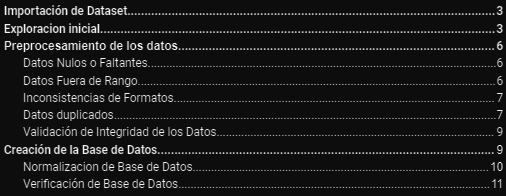

# ETL - Base de Datos

Procesamiento ETL sobre un dataset de ***'real estate'*** tomado de [esta](https://www.kaggle.com/datasets/supriyoain/real-estate-sales-2001-2020) competencia de Kaggle.

* **Detalles en el [Informe](https://github.com/maxogod/ETL-Real-Estate/blob/main/informe.pdf).**
* **Codigo fuente en el [Jupiter Notebook](https://github.com/maxogod/ETL-Real-Estate/blob/main/etl_colab.ipynb).**

### Outline del informe

